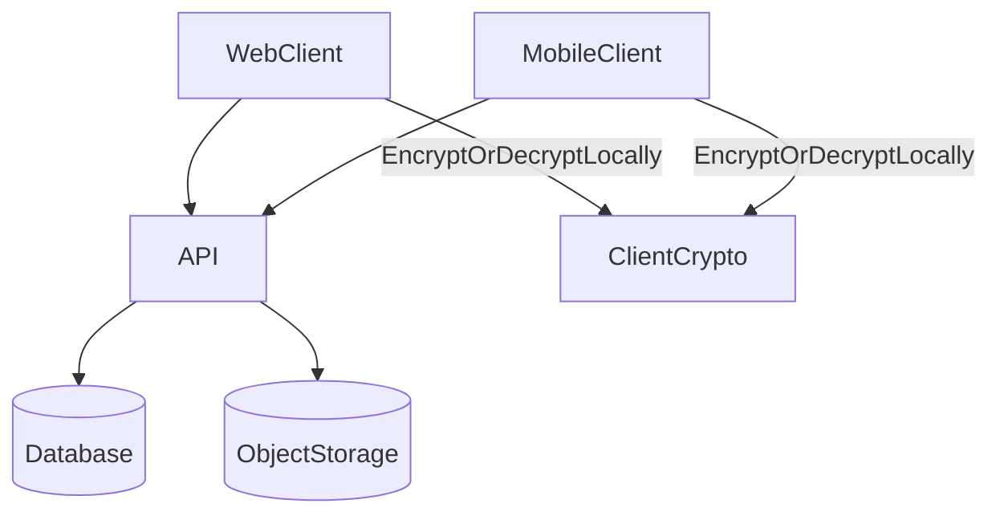

Halycron is designed around a simple split:

- **The server coordinates** (auth, authorization, metadata, presigned URLs).
- **Your devices decrypt** (photos + filenames) after you unlock your vault.

## What runs where

<CardGroup cols={2}>
  <Card title="Web app" icon="globe">
    The main UI plus client-side encryption/decryption, vault unlock, and sharing.
  </Card>
  <Card title="Mobile app" icon="mobile">
    The on-device experience: encryption/decryption, secure key storage, and local caching.
  </Card>
  <Card title="API" icon="server">
    Sessions, authorization, metadata APIs, and presigned upload/download URLs.
  </Card>
  <Card title="Database" icon="database">
    Stores wrapped keys + encrypted metadata (never plaintext UMK/DEKs/filenames for encrypted items).
  </Card>
  <Card title="Object storage" icon="hard-drive">
    Stores encrypted photo bytes under opaque object keys (no filenames).
  </Card>
  <Card title="Docs" icon="book-open">
    Product and security documentation (this site).
  </Card>
</CardGroup>

## Data flows (at a glance)

## Security posture summary

- The server is an **orchestrator**: it authenticates, authorizes, and routes encrypted data.
- Your device is the **decryptor**: it holds secrets and performs crypto once the vault is unlocked.

For the security model, see:
- [Zero-knowledge E2EE (overview)](/explanation/zero-knowledge-e2ee)
- [Threat model](/explanation/threat-model)
- [Key management](/explanation/key-management)

## Where encryption happens

<AccordionGroup>
  <Accordion title="On upload">
    The client encrypts bytes and filename locally, uploads encrypted bytes, then stores encrypted metadata and wrapped keys.
  </Accordion>
  <Accordion title="On download">
    The client fetches encrypted bytes via a presigned URL and decrypts locally after unwrapping the per-photo DEK.
  </Accordion>
  <Accordion title="On share">
    The sharer creates a Share Key (SK) and stores share-specific wrapped keys so recipients can decrypt without the owner’s UMK.
  </Accordion>
</AccordionGroup>

## Operational boundaries

<Note>
Authentication and encryption are intentionally decoupled. You can be logged in without the vault being unlocked on that device.
</Note>

See: [Authentication and sessions](/explanation/auth-and-sessions).

## Recommended reading order

<Steps>
  <Step title="1) Zero-knowledge E2EE (overview)">
    The product promise and what is (and isn’t) protected.
  </Step>
  <Step title="2) Key management">
    The vault, recovery key, password reset, and sharing keys.
  </Step>
  <Step title="3) Storage and sync">
    Where encrypted bytes and encrypted metadata live, and how uploads/downloads work.
  </Step>
  <Step title="4) Threat model">
    Trust boundaries, threat actors, and residual risks.
  </Step>
</Steps>

