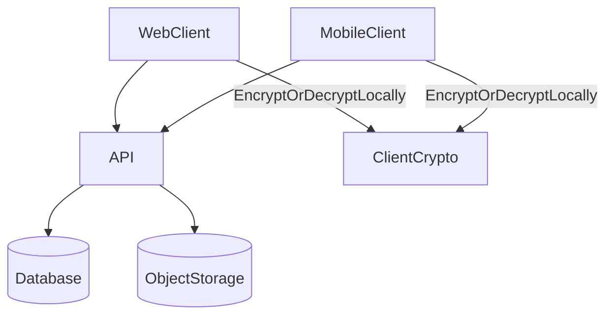

## Components

<CardGroup cols={2}>
  <Card title="Web app" icon="globe">
    UI + client-side encryption/decryption, vault unlock, sharing.
  </Card>
  <Card title="Mobile app" icon="mobile">
    UI + encryption/decryption, secure key storage, local caching.
  </Card>
  <Card title="API" icon="server">
    Authentication, authorization, metadata storage, and presigned URLs.
  </Card>
  <Card title="Database" icon="database">
    Stores wrapped keys and encrypted metadata; never stores plaintext UMK/DEKs/filenames for encrypted items.
  </Card>
  <Card title="Object storage" icon="hard-drive">
    Stores encrypted photo bytes under opaque object keys.
  </Card>
  <Card title="Docs" icon="book-open">
    Product and security documentation (this site).
  </Card>
</CardGroup>

## Data flows (at a glance)

## Security posture summary

- The server is an **orchestrator**: it authenticates, authorizes, and routes encrypted data.
- The client is the **decryptor**: it holds secrets and performs crypto once the vault is unlocked.

For the security model, see:
- [Zero-knowledge E2EE (overview)](/explanation/zero-knowledge-e2ee)
- [Threat model](/explanation/threat-model)
- [Key management](/explanation/key-management)

## Where encryption happens

<AccordionGroup>
  <Accordion title="On upload">
    The client encrypts bytes and filename locally, uploads encrypted bytes, then stores encrypted metadata and wrapped keys.
  </Accordion>
  <Accordion title="On download">
    The client fetches encrypted bytes via a presigned URL and decrypts locally after unwrapping the per-photo DEK.
  </Accordion>
  <Accordion title="On share">
    The sharer creates a Share Key (SK) and stores share-specific wrapped keys so recipients can decrypt without the owner’s UMK.
  </Accordion>
</AccordionGroup>

## Operational boundaries

<Note>
Authentication and encryption are intentionally decoupled. You can be logged in without the vault being unlocked on that device.
</Note>

See: [Authentication and sessions](/explanation/auth-and-sessions).

