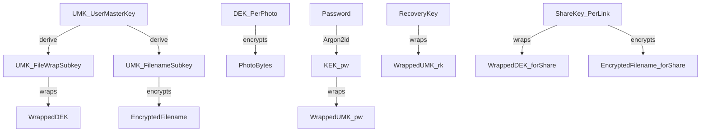

## Overview

Halycron’s key management exists to make three product promises true at the same time:

- **If we get breached, your photos + filenames stay private** (zero-knowledge at rest).
- **You can reset your password without losing access**.
- **Sharing stays simple** (open link → optional PIN → view) without handing the server decryption keys.

It also supports **passwordless session creation** (e.g., QR login): the server can log you in, but your device still needs to unlock the vault to decrypt.

If you haven’t read it yet, start with: [Zero-knowledge E2EE (overview)](/explanation/zero-knowledge-e2ee) and [Threat model](/explanation/threat-model).

## Key hierarchy (what keys exist)

<CardGroup cols={2}>
  <Card title="UMK (User Master Key)" icon="key">
    Root secret generated on-device. Never stored server-side in plaintext.
  </Card>
  <Card title="DEK (Data Encryption Key)" icon="lock">
    Random per-photo key used to encrypt photo bytes.
  </Card>
  <Card title="KEK_pw" icon="fingerprint">
    Password-derived key (Argon2id) used only to wrap/unwrap the UMK.
  </Card>
  <Card title="RK (Recovery Key)" icon="life-buoy">
    One-time shown recovery secret used to regain access after password reset.
  </Card>
  <Card title="SK (Share Key)" icon="share-2">
    Per-share link key used to enable recipients to decrypt without the owner’s UMK.
  </Card>
</CardGroup>

## What is stored where (and why)

### On the server (database)

The server stores **only wrapped keys and encrypted metadata**.

Examples (conceptual):

- `user_keys`: salt/params + `WrappedUMK_pw` + `WrappedUMK_rk`
- `photos`: `WrappedDEK` + `EncryptedFilename` + content IV + opaque object key
- `shared_link_keys` (PIN shares): `SK_wrapped_by_PIN` + PIN KDF params
- `shared_photos`: `WrappedDEK_forShare` + `EncryptedFilename_forShare`

<Note>
The server can authorize access and hand out presigned URLs, but it cannot decrypt without client-supplied secrets.
</Note>

### On the client (device)
- When locked, the client holds **no plaintext UMK**.
- When unlocked, the UMK exists in memory, and may be cached locally in device storage encrypted under a device key (platform-specific).

## Vault unlock flows

<Steps>
  <Step title="Fast path: unlock from device cache">
    If a device has a locally cached UMK (encrypted at rest in platform storage), it can unlock without running the password KDF again.
  </Step>
  <Step title="Password unlock">
    - Fetch wrapped UMK from the server.
    - Derive the password key using Argon2id (salt + params).
    - Decrypt UMK locally.
    - Cache UMK for future fast unlock (optional).
  </Step>
  <Step title="Recovery unlock (after password reset)">
    - User provides Recovery Key (RK).
    - Decrypt UMK locally with RK.
    - Rewrap UMK under the new password-derived key and update the server.
  </Step>
</Steps>

<Tip>
Authentication (session) and vault unlock (keys) are intentionally decoupled. After QR login, you may be logged in but still vault-locked until you unlock locally.
</Tip>

## How photos are protected (per-photo keys)

1) Client generates a random **DEK** per photo.
2) Client encrypts photo bytes using DEK.
3) Client wraps DEK under a UMK-derived wrap key and stores `WrappedDEK`.
4) Client encrypts filename under a UMK-derived filename key and stores `EncryptedFilename`.

The server stores encrypted bytes and encrypted metadata; the client unwraps/decrypts locally.

See: [Storage and sync](/explanation/storage-and-sync).

## Sharing key management (same UX, no server-held decryption keys)

### Non‑PIN share links
- A per-link **Share Key (SK)** is generated on the sharer’s device.
- The link includes `#k=...` so the SK is delivered via the **URL fragment**.
- The server never receives the fragment, so it never learns SK.

Recipient uses SK to unwrap per-photo keys and decrypt locally.

### PIN-protected share links
- SK is stored on the server **encrypted under a PIN-derived key** (Argon2id).
- Recipient enters PIN → derives key locally → decrypts SK locally.

<Warning>
A 4-digit PIN is low-entropy. PIN shares should be treated as a usability feature with controls (rate limits, monitoring), not as high-grade cryptographic authentication.
</Warning>

## Password changes and key rotation

### Password change
Changing a password should not require re-encrypting photos.

Instead:
- the client decrypts UMK (via old password or RK)
- then rewraps UMK under the new password-derived key

### Future rotation (roadmap)
UMK rotation would require rewrapping all photo keys and re-encrypting filenames; it should be treated as a migration and handled explicitly with versioning.

## Operational guardrails
- Never log keys or include secrets in query params.
- Only non-PIN share links put SK in the URL fragment (not sent to server).
- Avoid putting filenames in object keys or download headers.
- Rate-limit PIN verification and share accesses.

For practical defenses: [Key security considerations](/explanation/key-security-considerations).

## Recommended reading order

<Steps>
  <Step title="1) Zero-knowledge E2EE (overview)">
    The product promise and scope of “zero-knowledge”.
  </Step>
  <Step title="2) Storage and sync">
    Where encrypted bytes and encrypted metadata live, and what gets uploaded when.
  </Step>
  <Step title="3) Authentication and sessions">
    Why login (session) is separate from unlock (keys), including QR login.
  </Step>
  <Step title="4) Threat model">
    What we defend against and what remains out of scope.
  </Step>
</Steps>

