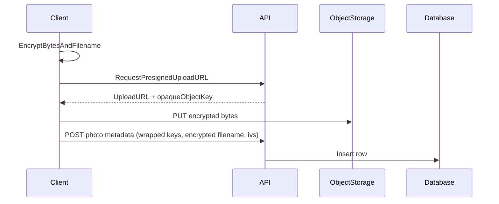

## Overview

Halycron uses a split-storage model so uploads are fast and the server stays blind:

- **Object storage** stores encrypted photo bytes.
- **Database** stores encrypted metadata and wrapped keys needed for client decryption.

The server coordinates authorization and delivery (e.g., presigned URLs), while the client performs encryption/decryption.

## What is stored in object storage

- Encrypted photo bytes.
- Opaque object keys (no filenames embedded).

<Note>
Even with encryption, object size and access timing can leak metadata. See [Threat model](/explanation/threat-model).
</Note>

## What is stored in the database

For each photo the server stores enough encrypted material for the client to decrypt:

- wrapped per-photo DEK
- encrypted filename
- IVs / nonces needed by the encryption scheme
- MIME type and (optional) dimensions
- opaque object key reference

## Upload flow (simplified)

<Steps>
  <Step title="Client encrypts locally">
    The client generates a per-photo key (DEK), encrypts the photo bytes, and encrypts the filename.
  </Step>
  <Step title="Client uploads encrypted bytes">
    The client uploads encrypted bytes to object storage using a presigned URL.
  </Step>
  <Step title="Client writes encrypted metadata">
    The client writes wrapped keys and encrypted metadata to the database via the API.
  </Step>
</Steps>

## Download flow (simplified)

<Steps>
  <Step title="Client requests download URL">
    The server returns a presigned download URL for the opaque object key.
  </Step>
  <Step title="Client decrypts locally">
    The client unwraps the per-photo DEK and decrypts bytes and filename locally.
  </Step>
</Steps>

## Caching and offline behavior (client-side)

### Web
- Decrypted image data may be cached in-memory or as object URLs.
- Keys should be kept in memory only when the vault is unlocked.

### Mobile
- Decrypted files may be cached to disk for performance.
- UMK may be cached encrypted in secure storage (device key / OS-protected store).

<Warning>
Caching improves UX but increases the impact of a compromised device. Users should treat device security (lock screen, OS updates) as part of the protection model.
</Warning>

## Sharing and sync

Sharing uses a separate share-key model so recipients can decrypt without the owner UMK.

See: [Key management](/explanation/key-management).

## Recommended reading order

<Steps>
  <Step title="1) Zero-knowledge E2EE (overview)">
    The big picture and what “zero-knowledge” means in Halycron.
  </Step>
  <Step title="2) Key management">
    UMK/DEK/RK/SK and how the vault unlocks on a device.
  </Step>
  <Step title="3) Threat model">
    What we assume, what we protect, and what we don’t.
  </Step>
  <Step title="4) Key security considerations">
    Practical controls around XSS, devices, caching, and sharing.
  </Step>
</Steps>

