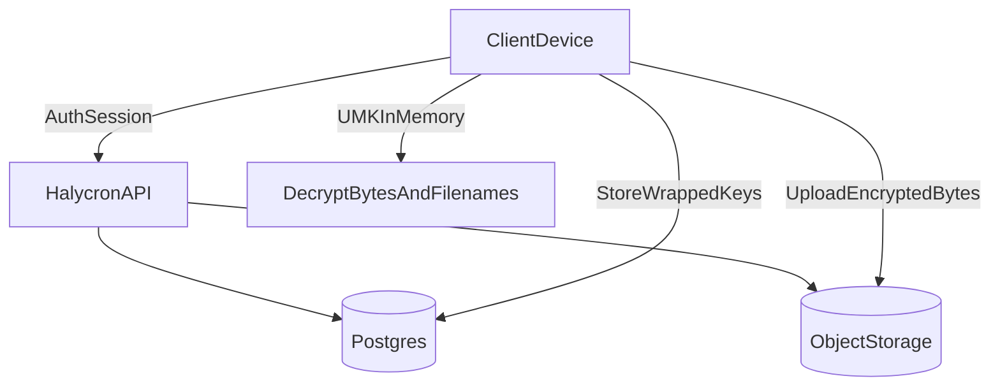

## Summary (what we’re promising)

Halycron’s goal is **zero-knowledge at rest**: if an attacker gets **database + object storage** access, they still cannot recover:

- **Photo bytes**
- **User-visible filenames**

This document describes the threat model for that promise: **what we protect**, **who we protect against**, and the **residual risks** we accept.

<Warning>
Zero-knowledge does not mean “no risk.” A compromised client device, browser XSS, or malicious extension can still exfiltrate keys after unlock.
</Warning>

## Scope

### In scope
- Protecting **v1 (E2EE) photos and filenames** from a server-side data breach.
- Protecting shared-link recipients’ content under the share-key model (non‑PIN and PIN).

### Out of scope (explicitly not promised)
- Compromised **client device** (rooted phone, malware).
- **Web XSS** / malicious browser extensions.
- Strong guarantees against a malicious server tricking clients (e.g., PAKE/OPAQUE, key transparency).
- Traffic analysis and metadata privacy (IP address, access patterns, photo sizes).

## System model (high level)

<Note>
The server stores encrypted blobs and metadata needed to route/authorize requests, but it does not have the plaintext keys required to decrypt v1 photo bytes or filenames.
</Note>

## Assets (what must be protected)

<CardGroup cols={2}>
  <Card title="Photo bytes" icon="image">
    The encrypted image content stored in object storage.
  </Card>
  <Card title="Filenames" icon="file">
    User-visible filenames, encrypted client-side for v1.
  </Card>
  <Card title="UMK (User Master Key)" icon="key">
    Root secret generated on-device. Never sent to the server in plaintext.
  </Card>
  <Card title="DEK (per-photo data key)" icon="lock">
    Random key per photo that encrypts bytes; wrapped before storage.
  </Card>
  <Card title="RK (Recovery Key)" icon="life-buoy">
    One-time shown key used to recover UMK after password reset.
  </Card>
  <Card title="SK (Share Key)" icon="share-2">
    Per-share key used for shared link decryption (URL fragment for non‑PIN, PIN-wrapped for PIN shares).
  </Card>
</CardGroup>

## Trust boundaries (who can see what)

### Client (web/mobile)
- Holds plaintext keys only when the vault is unlocked.
- Performs encryption/decryption.
- Must protect against local compromise to uphold guarantees.

### Server API
- Authenticates sessions.
- Stores and returns wrapped key material.
- Generates presigned object URLs.
- Must not learn UMK/SK.

### Database
- Stores wrapped keys and encrypted metadata.

### Object storage
- Stores encrypted bytes.
- Object keys must not include sensitive data (e.g., filenames).

## Threat actors

<AccordionGroup>
  <Accordion title="DB + object storage attacker">
    **Capability**: full read access to Postgres and object storage (S3).

    **Goal**: decrypt photos and filenames.

    **Expected outcome (v1)**: cannot decrypt without UMK/SK.
  </Accordion>
  <Accordion title="Server compromise (RCE / rogue operator)">
    **Capability**: can modify API responses, read DB, read object storage.

    **Goal**: recover plaintext content.

    **Expected outcome (v1)**: still cannot decrypt at rest without client key material, but can attempt social/UX attacks to trick users into leaking keys.
  </Accordion>
  <Accordion title="Network attacker (MITM)">
    **Capability**: observe or tamper with traffic.

    **Expected outcome**: TLS protects transport, but metadata (timing, sizes) may still leak. MITM is out-of-scope beyond standard TLS.
  </Accordion>
  <Accordion title="Malicious recipient of a shared link">
    **Capability**: has the shared link; may try to brute-force a PIN if PIN-protected.

    **Expected outcome**: non‑PIN links grant access to whoever has the link (by design). PIN shares rely on rate limiting + KDF cost and are only as strong as the PIN + controls.
  </Accordion>
  <Accordion title="Compromised client (device malware / XSS)">
    **Capability**: reads memory/storage, keylogs, exfiltrates UMK/SK.

    **Expected outcome**: can decrypt content after unlock. This is a primary residual risk.
  </Accordion>
</AccordionGroup>

## Security properties and how we achieve them

### Property: “DB + object storage breach cannot decrypt v1 photos + filenames”
- **How**:
  - Photo bytes encrypted client-side with a per-photo DEK.
  - DEK is wrapped client-side using a UMK-derived wrap key.
  - Filenames encrypted client-side using a UMK-derived filename key.
  - Object keys are opaque (no filenames in keys).

### Property: “Password reset does not lose access”
- **How**:
  - The UMK is additionally wrapped under a Recovery Key (RK).
  - User saves RK once; it can recover UMK and rewrap under a new password-derived key.

### Property: “Sharing works without server learning keys”
- **Non‑PIN shares**:
  - Share Key (SK) is carried in the URL fragment (`#k=...`) and never reaches the server.
- **PIN shares**:
  - Server stores SK encrypted under a PIN-derived key (slow KDF). Recipient supplies PIN to derive the key and decrypt SK locally.

## Threats → mitigations (practical checklist)

| Threat | What could happen | Mitigation | Residual risk |
|---|---|---|---|
| DB breach | Attacker reads encrypted metadata and wrapped keys | Client-side encryption + wrapped keys only; server never stores plaintext UMK/DEK/filenames | Access patterns and account metadata may still leak |
| Object storage listing | Filename leakage via object key names | Opaque object keys for v1; migrate old keys by copying to new opaque keys | Size/timing metadata still leaks |
| Server compromise | Server tries to decrypt v1 content | Server never has UMK/SK; only receives wrapped blobs | Server can still attempt phishing/UX attacks |
| PIN share brute-force | Guess PIN to decrypt shared content | KDF cost, rate limiting, lockouts, monitoring | A 4-digit PIN is low entropy; treat as “speed bump” |
| Web XSS | Steal UMK from memory/IndexedDB | CSP, strict sanitization, dependency hygiene, isolate secrets | Still high risk on web; document explicitly |
| Compromised phone | Exfiltrate UMK from SecureStore | OS security + biometrics gate + threat awareness | If device is compromised, content can be decrypted |

## Residual risks (important to state clearly)

<Warning>
If an attacker controls the client (XSS, malware, rooted device), they can capture UMK/SK once the vault is unlocked. Zero-knowledge does not protect against this class of attack.
</Warning>

Key residual risks we accept:
- **Client compromise**: keys can be exfiltrated.
- **Metadata leakage**: access patterns, object sizes, IP addresses.
- **Link sharing semantics**: non‑PIN shares are effectively bearer tokens.
- **PIN strength**: 4-digit PIN is not strong cryptographic protection without additional controls.

## Operational controls (what we must do outside crypto)
<Steps>
  <Step title="Protect against share brute-force">
    Rate-limit PIN verification, monitor for abuse, and consider progressive delays or temporary blocks.
  </Step>
  <Step title="Harden the web client against XSS">
    Strong CSP, reduce inline scripts, audit third-party dependencies, and avoid persisting UMK in long-lived storage unless explicitly accepted.
  </Step>
  <Step title="Make recovery key UX unskippable">
    Present RK once and require explicit acknowledgment; offer safe re-display only if user proves possession (future).
  </Step>
</Steps>

## Appendix: glossary of keys (quick reference)

- **UMK**: User Master Key (root secret, client-generated).
- **KEK_pw**: password-derived key (Argon2id) used to wrap UMK for password unlock.
- **RK**: Recovery Key (random, shown once).
- **DEK**: per-photo data key used to encrypt bytes.
- **SK**: per-share key used for shared links.

<Note>
This threat model assumes v1 encryption primitives are implemented correctly (AEAD, nonces, key lengths) and that crypto versioning is explicit to support future migrations.
</Note>

## Recommended reading order

<Steps>
  <Step title="1) Zero-knowledge E2EE (overview)">
    The product promise and the scope of what “zero-knowledge” means here.
  </Step>
  <Step title="2) Architecture overview">
    A map of the system components and where encryption/decryption happens.
  </Step>
  <Step title="3) Key management">
    Vault unlock, recovery key, password reset, and sharing keys.
  </Step>
  <Step title="4) Key security considerations">
    The real-world risks (XSS, device compromise) and practical controls.
  </Step>
</Steps>

