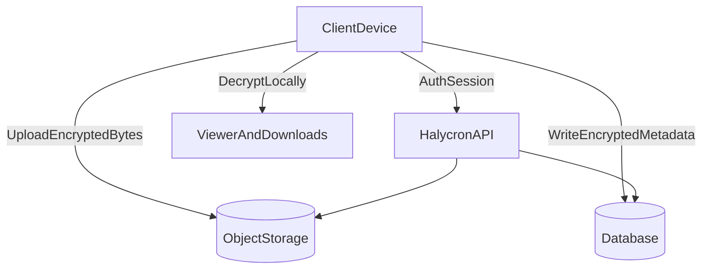

## TL;DR

Halycron is built so **only your devices** can decrypt your library. If someone steals **our database + object storage**, they still can’t read:

- photo bytes
- user-visible filenames

That’s the core “zero-knowledge at rest” promise for encrypted items.

<Note>
Zero-knowledge is a property of how we store and manage keys. It does not prevent compromise of a client device or browser.
</Note>

## What “zero-knowledge” means here

In Halycron, “zero-knowledge” is primarily about **at-rest confidentiality** against server-side breaches:

- The server stores **wrapped keys** and **encrypted metadata**.
- The client performs encryption/decryption after the vault is unlocked.

<CardGroup cols={2}>
  <Card title="Protected" icon="lock">
    Photo bytes and user-visible filenames (for encrypted items).
  </Card>
  <Card title="Not hidden" icon="eye">
    Metadata like access patterns, file sizes, timestamps, and IP addresses.
  </Card>
</CardGroup>

## System sketch

## How E2EE shows up in the product

### Vault
The **Vault** is the client-side component responsible for holding the User Master Key (UMK) in memory when unlocked.

- Web: vault unlock is separate from login (sessions vs keys).
- Mobile: the vault can be gated behind biometrics and device secure storage.

See: [Key management](/explanation/key-management) and [Authentication and sessions](/explanation/auth-and-sessions).

### Photos and filenames
- Photo bytes are encrypted under a per-photo key (DEK).
- Filenames are encrypted so they are not visible in DB or object keys.

See: [Storage and sync](/explanation/storage-and-sync).

### Sharing links
Sharing is designed to preserve a familiar UX (“open link → optional PIN → view”), without giving the server decryption keys.

See: [Key management](/explanation/key-management).

## What this does not protect against

<Warning>
If an attacker controls your device or your browser environment (malware, XSS, malicious extensions), they can steal keys after you unlock the vault and decrypt content. Zero-knowledge does not prevent this.
</Warning>

## Recommended reading order

<Steps>
  <Step title="1) Architecture overview">
    A high-level map of the web app, mobile app, API, database, and object storage.
  </Step>
  <Step title="2) Key management">
    How the vault works, how password reset keeps access, and how sharing stays familiar.
  </Step>
  <Step title="3) Storage and sync">
    What lives in object storage vs the database, and what gets encrypted where.
  </Step>
  <Step title="4) Threat model + key security considerations">
    What we protect against, what we don’t, and the practical controls that matter most.
  </Step>
</Steps>

